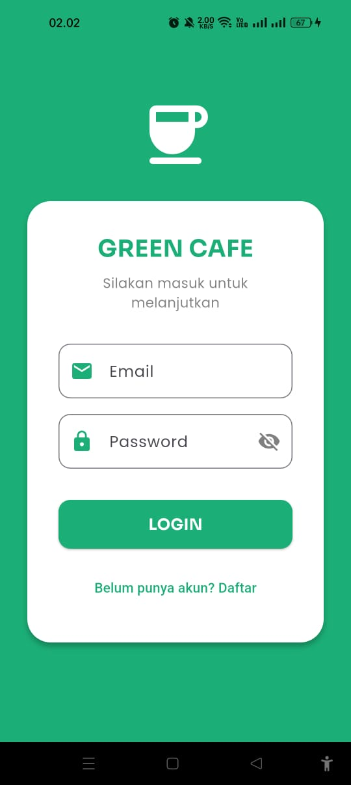
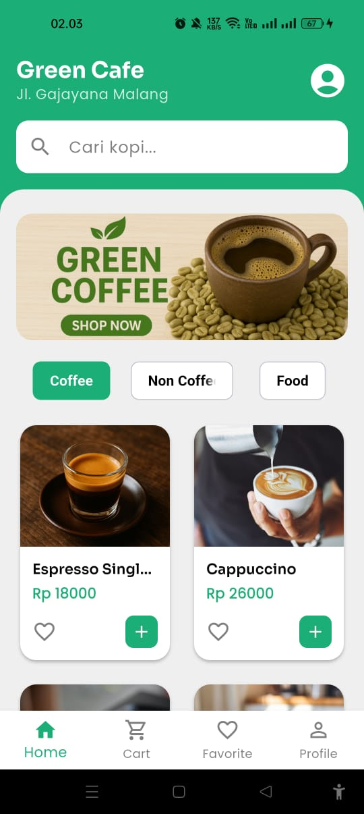

# Green Cafe - Coffee Shop Mobile App


Green Cafe adalah aplikasi mobile untuk pemesanan kopi yang dibangun menggunakan Flutter. Aplikasi ini menyediakan pengalaman pengguna yang seamless untuk menjelajahi menu, menambahkan ke favorit, dan melakukan pemesanan kopi dengan mudah.

## Screenshots

<div align="center">
  
  
</div>

## Fitur

### Untuk Customer

- **Onboarding** - Tampilan awal yang menarik untuk pengguna baru
- **Authentication** - Login dan Register dengan validasi
- **Home** - Menampilkan daftar menu kopi dengan filter kategori
- **Search** - Pencarian menu dengan debounce untuk performa optimal
- **Detail Produk** - Informasi lengkap tentang produk kopi
- **Favorit** - Simpan kopi favorit Anda
- **Keranjang** - Kelola pesanan sebelum checkout
- **Checkout** - Proses pemesanan yang mudah
- **Profil** - Lihat informasi akun pengguna

### Untuk Admin

- **Dashboard Admin** - Kelola semua produk kopi
- **CRUD Produk** - Tambah, Edit, dan Hapus produk
- **Manajemen Menu** - Update informasi produk secara real-time

## Teknologi

- **Framework**: Flutter 3.9.0
- **Bahasa**: Dart
- **State Management**: StatefulWidget (Provider Pattern)
- **HTTP Client**: http package
- **Typography**: Google Fonts (Sora & Poppins)
- **Backend**: MockAPI.io

## Dependencies

```yaml
dependencies:
  flutter:
    sdk: flutter
  http: ^1.2.1
  google_fonts: ^6.2.1
  cupertino_icons: ^1.0.8
```

## Instalasi

### Prasyarat

- Flutter SDK (3.9.0 atau lebih tinggi)
- Android Studio / VS Code
- Emulator atau Device fisik

### Langkah-langkah

1. **Clone repository**

   ```bash
   git clone https://github.com/Fahmi1945/Green-Cafe.git
   cd Green-Cafe
   ```

2. **Install dependencies**

   ```bash
   flutter pub get
   ```

3. **Jalankan aplikasi**
   ```bash
   flutter run
   ```

## Konfigurasi API

Aplikasi ini menggunakan MockAPI untuk backend. URL API sudah dikonfigurasi di:

- **Auth Service**: `lib/services/auth_service.dart`
- **Coffee Service**: `lib/services/coffee_service.dart`
- **Admin Dashboard**: `lib/pages/admin/admin_dashboard.dart`

Endpoint API:

```dart
// User Authentication
https://68fe947f7c700772bb1408b8.mockapi.io/user

// Coffee Products
https://68fe947f7c700772bb1408b8.mockapi.io/coffee
```

## Struktur Projekt

```
lib/
├── main.dart                 # Entry point aplikasi
├── models/                   # Data models
│   ├── coffee_model.dart
│   └── user_model.dart
├── services/                 # API services
│   ├── auth_service.dart
│   └── coffee_service.dart
├── pages/                    # UI Screens
│   ├── intro/
│   │   └── onboarding_page.dart
│   ├── auth/
│   │   ├── login_page.dart
│   │   └── register_page.dart
│   ├── customer/
│   │   ├── main_wrapper.dart
│   │   ├── home_page.dart
│   │   ├── detail_page.dart
│   │   ├── cart_page.dart
│   │   ├── favorite_page.dart
│   │   ├── checkout_page.dart
│   │   ├── order_success_page.dart
│   │   └── profile_page.dart
│   └── admin/
│       ├── admin_dashboard.dart
│       └── add_edit_product.dart
└── widget/                   # Reusable widgets
    └── product_card.dart
```

## Design System

### Color Palette

- **Primary Green**: `#1BAE76`
- **Scaffold Background**: `#EFEFEF`
- **White**: `#FFFFFF`
- **Grey**: `#808080`
- **Black**: `#000000`

### Typography

- **Headings**: Sora (Bold & Semi-Bold)
- **Body Text**: Poppins (Regular & Medium)

## User Roles

### Customer

- Email: `customer@test.com`
- Password: `123456`

### Admin

- Email: `admin@test.com`
- Password: `admin123`

## Fitur Keamanan

- Password toggle visibility
- Form validation
- Email uniqueness check
- Role-based access control

## Responsive Design

Aplikasi ini didesain untuk berbagai ukuran layar:

- Smartphone (Portrait & Landscape)
- Tablet
- Foldable devices

## Testing

```bash
# Run tests
flutter test

# Run tests with coverage
flutter test --coverage
```

## API Structure

### User Model

```json
{
  "id": "1",
  "name": "John Doe",
  "email": "john@example.com",
  "password": "hashed_password",
  "role": "customer"
}
```

### Coffee Model

```json
{
  "id": "1",
  "name": "Caffe Latte",
  "price": "25000",
  "imageUrl": "https://example.com/image.jpg",
  "description": "Espresso dengan susu steamed yang creamy",
  "category": "Coffee"
}
```

## Kontribusi

Contributions are welcome! Silakan buat pull request atau buka issue untuk saran dan perbaikan.

1. Fork repository
2. Buat branch fitur (`git checkout -b feature/AmazingFeature`)
3. Commit perubahan (`git commit -m 'Add some AmazingFeature'`)
4. Push ke branch (`git push origin feature/AmazingFeature`)
5. Buat Pull Request

## License

This project is licensed under the MIT License - see the LICENSE file for details.

## Developer

**Fahmi**

- GitHub: [@Fahmi1945](https://github.com/Fahmi1945)
- Repository: [Green-Cafe](https://github.com/Fahmi1945/Green-Cafe)

## Acknowledgments

- Flutter Team untuk framework yang luar biasa
- MockAPI.io untuk REST API gratis
- Unsplash untuk stock images
- Google Fonts untuk typography

## Support

Jika Anda memiliki pertanyaan atau butuh bantuan, silakan buka issue di GitHub repository.

---

Jangan lupa untuk memberikan star jika project ini membantu Anda!
